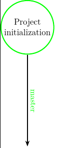
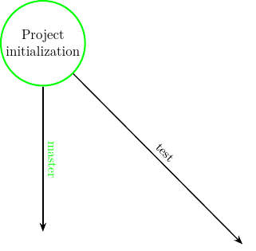
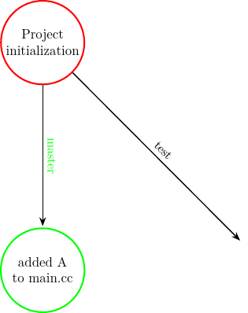
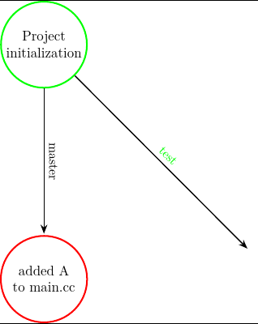
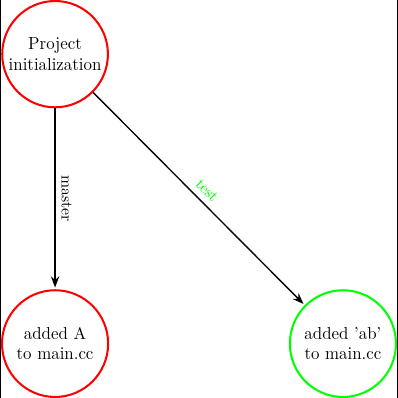
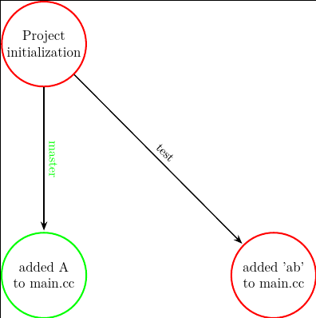
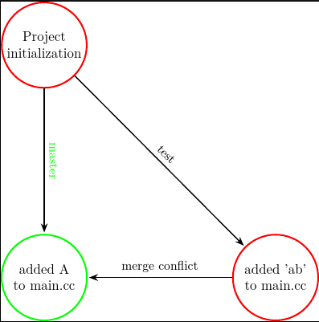
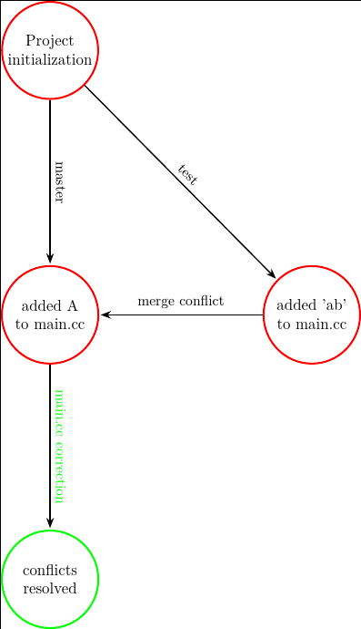
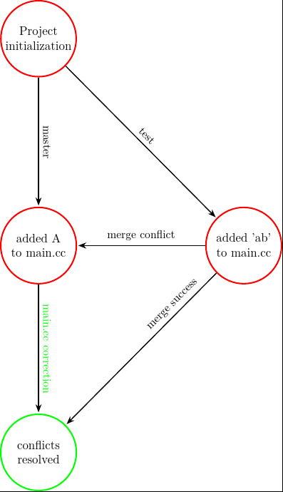
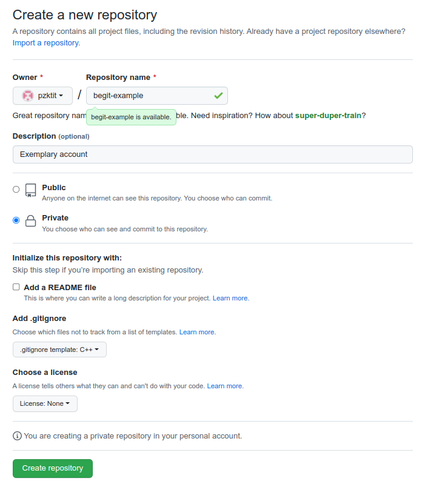

# Będzie Git

Git to system kontroli wersji stworzony przez społeczność pracującą nad jądrem Linuksa.
Motywacją do stworzenia własnego systemu była zmiana licencji narzędzia używanego poprzednio.
W nowym systemie nowatorskie podejście, które pozwoliło na rozwiązanie wielu problemów będących poza zasięgiem dla funkcjonujących wtedy systemów wersjonowania.
Obecnie Git jest najpowszechniej używanym narzędziem.
Dzięki swojej uniwersalności pozwala na realizację wielu przepływów pracy (ang. _workflow_), tym samym emulację innych rozwiązań w ramach tej samej struktury danych.

## Geneza

Tworzenie oprogramowania lub pisanie tekstów to najpowszechniejsze formy działalności twórczej.
Powstawanie dzieła prawie zawsze wiąże się z koniecznością wprowadzania poprawek, wycofywania już wprowadzonych zmian, a w przypadku dzieł wieloautorskich, koniecznością synchronizacji wprowadzanych zmian.

Prymitywnym sposobem radzenia sobie z tymi problemami jest zapisywanie kolejnych wersji dzieła w osobnych katalogach (najlepiej zawierających znacznik czasu) i korzystanie z narzędzi wykrywających wprowadzone zmiany (w Linuksie takim narzędziem jest `diff`).
Niestety jest to podejście:

* nieefektywne ze względu na wykorzystanie przestrzeni dyskowej,
* żmudne, bo wszystkie działania należy wykonać ręcznie, a co za tym idzie, bardzo podatne na błędy.

Rozwiązaniu obu problemów służyły pierwsze narzędzia kontroli wersji pracujące lokalnie na komputerze twórcy i zarządzające plikami zgromadzonymi w lokalnych folderach.
Przykładem takiego narzędzia jest _Revision Control System_ (`rcs` w Linuksie).
Problem efektywnego wykorzystania przestrzeni dyskowej rozwiązano przy użyciu tzw. _techniki delta_, w której kolejne wersje dzieła są opisane jako różnice względem wersji poprzedzającej.

Problem koordynacji działań wielu autorów rozwiązano, stosując wersje sieciowe z centralnym repozytorium, w którym zapisywane są wszystkie zmiany wprowadzane przez twórców.
Przykładami takich serwerów są _Control Version System_ lub _Subversion_ (odpowiednio `cvs` i `svn` w Linuksie).
Praca z takim systemem wymaga częstej komunikacji z serwerem, w celu uniknięcia kolizji zmian wprowadzonych przez autorów. Z powyższego wynika również, że każdy, kto chciałby coś wnieść do projektu, musi mieć zarejestrowane konto na serwerze i prawo zapisu.
Zatem systemy te mają charakterystykę niespójną z modelem rozwoju projektów _Open Source_, w których naczelnym motywem jest możliwość uzupełniania projektu przez dowolne, często anonimowe osoby.
Co więcej, kopia dzieła jest _de facto_ utrzymywana wyłącznie na serwerze kontroli wersji, zatem stanowi on tzw. SPOF (ang. _Single Point of Failure_) — w przypadku braku kopii zapasowej awaria serwera jest równoważna utracie dzieła.

Twórcy _Git_, aby dopasować go do specyfiki zarządzania projektami _Open Source_, zerwali z podejściem stosowanych w innych rozwiązaniach, zarówno jeśli idzie o wewnętrzną reprezentację zmian w projekcie, jak i sposób zarządzania repozytoriami.
Rozwiązania zaimplementowane w _Git_ są na tyle uniwersalne, że przy ich użyciu można również emulować przepływ pracy stosowany we wcześniejszych rozwiązaniach.
Dzięki tej właściwości _GiT_ jest obecnie dominującym systemem kontroli wersji.

## Reprezentacja historii projektu w Git

W _Git_ każdy twórca ma u siebie na komputerze swoją kopię repozytorium opisującą historię projektu.
Takie repozytorium może zainicjować "od zera" w dowolnym katalogu, jak i probrać "migawkę" repozytorium innego autora.
Repozytorium lokalne i zdalne nie są automatycznie synchronizowane.
Każdy autor pracuje niezależnie nad swoją wersją projektu, a gdy uzna, że jego praca nadaje się do zaprezentowania innym, dokonuje jego synchronizacji z innymi repozytoriami.
_Git_ posługuje się specyficzną terminologią do opisu podejmowanych działań.
Celem niniejszego dokumentu jest jej objaśnienie.
Cel ten spróbuję osiągnąć, wskazując, jak komendy _Git_ wpływają na wewnętrzny stan repozytorium projektu.
Opis ten powstał w głównej mierze na podstawie znakomitej książki
[S. Chacon, B. Straub, "Pro Git"](https://git-scm.com/book/en/v2). 

_Git_ śledzi zmiany tylko w plikach wskazanych przez osobę pracującą nad projektem.
Wewnętrznie zmiany przechowywane są jako nakładki na poprzednią wersję projektu.
W nakładce:

* pliki zmienione przechowywane są w całości,
* pliki niezmienione są linkami do plików z poprzedniej wersji projektu,
* każda nakładka otrzymuje unikalny identyfikator wyznaczony jako skrót _SHA-1_ z jej treści,
* każda nakładka przechowuje Id poprzedzającej nakładki, dzięki czemu kolejność wprowadzanych modyfikacji jest ściśle określona.

Zmiany w historii projektu rejestrowane są przez autora w wybranych przez niego momentach czasu i tylko dla wskazanych przez niego plików.
Pliki oczekujące na rejestrację w historii zmian znajdują się w stanie _`stage`_.
Proces rejestracji zmian jest nazywany _`commit`_'em.
Prowadzi on do zbudowania nowej nakładki (która też jest nazywana _`commit`_em) oraz usunięcia plików z poczekalni _`stage`_.

Kolejne _`commit`_'y reprezentujące historię pracy nad projektem są zorganizowane w graf skierowany reprezentujący tzw. drzewo z powrotami.
Taka organizacja na prowadzenie prac nad różnymi aspektami projektu niezależnie i włączanie ich do wersji głównej, dopiero gdy będą na to gotowe.

rysunek

Drzewo opisujące historię projektu zazwyczaj złożone jest z wielu z gałęzi, z których każda ma swoją unikalną nazwę.
Gałąź główna zazwyczaj nosi nazwę _`master`_, ale to tylko kwestia konwencji, bo taką nazwę przypisuje `git` podczas inicjalizacji repozytorium, i nikomu zazwyczaj nie chce się tego zmieniać.
Z każdą gałęzią związany jest wskaźnik (o takiej samej nazwie jak gałąź), który domyślnie wskazuje bieżący _`commit`_ na danej gałęzi.
Jeżeli gałąź i _`commit`_ nie zostaną wskazane w sposób jawny, to `git` zastosuje je w miejscu określonym przez wskaźnik `HEAD`.

```bash
git branch
git branch <branchname>
git checkout <branchname>
git checkout -b <branchname>
```

* wypisanie nazw gałęzi drzewa,
* utworzenie gałęzi,
* ustawienie wskaźnika `HEAD` na wskaźniku gałęzi `<branchname>`,
* 2w1 - utworzenie gałęzi i ustawienie wskaźnika `HEAD`.

Warto zwrócić uwagę, że ustawienie wskaźnika `HEAD` na określone miejsce w historii projektu powoduje, że śledzone pliki w katalogu projektu przyjmą postać, jaką miały w momencie sporządzania tego _`commit`_'u.
Zatem wskaźnik `HEAD` daje możliwość "przewijania taśmy" do tyłu, do przodu, a nawet w bok, jeżeli uwzględnione zostaną inne gałęzie.

Tworzenie gałęzi i przełączanie się między nimi nie stwarza problemów.
Kłopoty mogą pojawić się wtedy, gdy chcemy połączyć kod źródłowy zmieniany niezależnie w dwóch gałęziach.
Pliki porównywane są linia po linii i konflikt powstaje wtedy, gdy zmiany dotyczą tej samej linii pliku.
W takim przypadku `git` odmawia wykonania synchronizacji pliku.
Użytkownikowi prezentowany jest plik z wyróżnionymi zmianami.
Zadaniem użytkownika jest wykonanie edycji tego pliku i wykonanie _`commit`_'a.
Plik ten jest traktowany jako wersja obowiązująca.
Teraz łączenie gałęzi może być wykonane bez przeszkód.
Warto zwrócić uwagę, że łączenie jest jednokierunkowe — gałąź wskazana jest włączana do gałęzi bieżącej, a sama pozostaje niezmodyfikowana.
Aby zsynchronizować dwie gałęzie, należy wykonać dwie operacje włączania, zmieniając w międzyczasie gałąź bieżącą.
Poniższa sekwencja komend ilustruje to zachowanie

```bash
touch main.cc sub.cc sub.h # pliki biorące udział w zabawie
git init # incjowanie repozytorium
git add main.cc sub.cc sub.h # zaznaczenie plików do synchronizacji
git commit -a -m "Project initialization" # pierwsza migawka
git log
```



```bash
git branch test # powstaje nowa gałąź, ale jesteśmy w master
git branch
```


```bash
echo "A\nB\n" > main.cc 
git commit -a -m "added A to main.cc" # modyfikacja i wykonanie migawki
```


```bash
git checkout test # przejście do gałęzi test
```


```bash
cat main.cc
echo "a" > main.cc 
echo "c" > sub.cc
git commit -a -m "added 'ab' to main.cc" # edycja plików i stworzenie migawki
git log
```


```bash
git checkout master # powrót do gałęzi głównej
```


```bash
git merge test # próba włączenia, mamy konflikt
```


```bash
cat main.cc
cat sub.cc # tu się udało
mcedit main.cc
git commit -a -m "conflicts resolved" # usunięcie konfliktu
```


```bash
git merge test # włączenie test do master
cat main.cc
```


Jednak gałąź _`test`_ nie zawiera zmian wprowadoznych w master. 
Jeżeli chcemy jej uaktualnienia, również należy wykonać operację `merge`,
lecz tym razem, gdy gałąź `test` jest aktywna.
```bash
git checkout test # ale test pozostał niezmieniony
cat main.cc
git merge master # pełna synchronizacja, gdy taki jest nasz zamiar
cat main.cc
git branche
git checkout master
```

## Praca ze zdalnymi repozytoriami

_Git_ w repozytorium lokalnym obok drzewa lokalnego, na którym wykonywane są operacje _`commit`_ może przechowywać kopie wybranych gałęzi drzew zewnętrznych.
Na gałęziach tych nie można wykonywać operacji _`commit`_, natomiast można się z nimi synchronizować za pomocą _`merge`_.
Gałąź zewnętrzna może być pobrana:

1. z innego katalogu w systemie plików,
2. z serwera _Git_ udostępnionego za pomocą protokołu SSH,
3. z serwera _Git_ udostępnionego za pomocą protokołu HTTPS.
  
Opcje te różnią się wymaganiami dotyczącymi uwierzytelnienia pobierającego. W pierwszym przypadku nie jest wymagane żadne uwierzytelnienie ze strony _Git_, ale dostepność katalogu jest _implicite_ ograniczona do sieci lokalnej.
W drugim wymaga się, aby na serwerze użytkownik miał skonfigurowane konto obsługujące uwierzytelnienie SSH za pomocą kluczy.
Oznacza to, że taka metoda współdzielenia zasobów nadaje się dobrze do pracy w zamkniętych grupach.
W ostatniej opcji użytkownik, korzystając z HTTPS, może do swojego repozytorium pobrać dane, nie posiadając żadnego konta na serwerze udostępniającym projekt.
Jak zobaczymy dalej istnienie takiej możliwości jest kluczowe dla realizji przepływu pracy w projektach Open Source, w których, co do zasady, każdy w dowolnym momencie może włączyć się do prac nad projektem.
Źródło pochodzenia zdalnego projektu definiujemy komendą `git remote`, dane ze zdalnego źródła pobieramy za pomocą `git fetch`, a synchronizację z lokalnym repozytorium wykonujemy za pomocą `git merge`.
Stan zdalnego repozytorium nie jest monitorowany, a jego lokalny obraz nie jest automatycznie aktualizowany.
Zadanie to spoczywa na deweloperze, który w wybranych przez siebie momentach czasu wykonuje `git fetch` i `git remote` (komendy te występują łacznie tak często, że zaimplementowano skrót `git pull`, który wykonuje obie te operacje).
Magiczna komenda `git clone` to kilka czynności naraz: inicjacja lokalnego repozytorium (`git init`), rejestracja zdalnego repozytorium (`git remote`), pobranie z niego danych (`git fetch`), i przeniesienie do lokalnego repozytorium (`git merge`).
Do umieszczenia efektów pracy na zdalnym repozytorium służy komenda `git push`, która wysyła kopię bieżącej gałęzi na zdalny serwer i wykonuje zdalnie `git merge`.
Oczywiście wykonanie `git push` wymaga prawa zapisu do zdalnego repeozytorium.
Zdalnym repozytoriom można nadawać skrócone nazwy. Pierwszemu zdalnemu repozytorium zzwyczaj przydziela się nazwę `origin`, zatem do głównej gałęzi tego repozytorium można się odwoływać przez nazwę `origin/master`.

Rozważmy scenariusz, w którym Alice i Bob będą pracować nad nową funckjonalnością aplikacji.
Niech repozytorium z poprzedniego punktu będzie dostępne w katalogu `../repo1`.
Alice wykonała jego kopię metodą szybką (tradycyjną)

```bash
A> git clone ../repo1/
A> git branch -a
```

Bob jest wielbicielem asemblera, wobec czego wykonał kopię ręcznie

```bash
B> mkdir -p manual-clone && cd manual-clone
B> git init
B> git remote add origin ../../repo1 -m master
B> git fetch --all # całe drzewo, alternatywnie można podać nazwy gałęzi
B> git checkout --track origin/master
B> git branch -a
```

Zasadniczo mogliby dodawać swoje _`commit`_'y do gałęzi `master`. Niestety, jeżeli założymy, że synchronizują swoje lokalne repozytoria za pośrednictwem serwera to wtedy w zewnętrznbym repozytorium w gałęzi `master` może znaleźć się kod, który nie działa właściwie, a nawet się nie kompiluje.
Aby uniknąć tej sytuacji, oboje zakładają gałąź `devel`, w której zgłaszają swoje poprawki do kodu

```bash
A> git checkout -b devel
A> git push --set-upstream origin devel
B> git branch devel && git checkout devel
B> git push --set-upstream origin devel
```

Oboje pracują niezależnie na swoich komputerach.
Przed opracowaniem _`commit`_'a każde z nich powinno pobrać na swój komputer aktualny stan zewnętrznego repozytorium.
Alice korzysta z wersji skrótowej, natomiast Bob jak zwykle robi wszystko "na piechotę".

Alice uzupełniła plik `sub.h` i dodała _`commit`_:

```bash
A> echo "A" > sub.h
A> git commit -a -m "A to sub.h"
A> git pull origin
```

a następnie zaktualizowała zdalne repozytorium

```bash
A> git push origin
```

Bob wprowadził dwie zmiany

```bash
B> echo "\nBob" >> main.cc ; echo "B" > sub.h  
B> git commit -a -m "B to sub.h"
B> git fetch
B> git merge
```

Niestety operacja `merge` się nie powiedzie.
Zmiana wprowadzona przez Boba jest w konflikcie ze zmianą wprowadzoną przez Alice.
Bob może ten konflikt rozwiązać lokalnie, edytując plik "`sub.h`", w którym _Git_ oznaczył fragmenty będące źródłem konfliktu

```
<<<<<<< HEAD
B
=======
A
>>>>>>> refs/remotes/origin/devel
```

Bob teraz musi rozwiązać napotkany konflikt.
Przyjmijmy, że uznał swoją modyfikację za lepszą

```bash
B> echo "B" > sub.h  
B> git commit -a -m "resolved, B to sub.h is better"
B> git fetch ; git merge ; git push
```

Alice cały czas pracuje. 
Dodała do zestawu plików "`main.h`".
Teraz ona wykonuje swoją sekwencję aktualizacji repozytorium

```bash
A> echo "Alice" > main.h  
A> git add main.h
A> git pull 
A> git commit -a -m "Finishing"
```

Ostatecznie Alice decyduje się zakończyć pracę nad modyfikacjami i włączyć je do gałęzi głównej

```bash
A> git checkout master
A> git merge develop
A> git push
```

**Uwaga!** Ostatnia komenda w pewnych przypadkach może się nie powieść.
Repozytoria _Git_ mogą być skonfigurowane w dwojaki sposób.
Jeżeli repozytorium służy tylko jako archiwum, to jest konfigurowane jako
repozytorium czyste/surowe/właściwe komendą

```bash
git config --bool core.bare true
```

W katalogu takiego repozytorium nie ma plików roboczych, jest tylko katalog `.git`.
Gdy takie repozytorium służy jako repozytorium zdalne wówczas komenda `git pull` uda się zawsze.
Jednak zdalnym repozytorium może być również repozytorium robocze innego dewelopera.
W repozytoriach tych stan plików w katalogu roboczym jest odzwierciedleniem stanu projektu zgodnie z wybraną gałęzią i pozycją wskaźnika _`HEAD`_.
Gdy zażądamy aktualizacji gałęzi aktywnej w zdalnym repozytorium roboczym, to pociąga to za sobą zmianę zawartości plików w zdalnym katalogu roboczym. Zatem istnieje ryzyko, że deweloper pracujący w tym repozytorium utraci swoją pracę. Dlatego też _git_ odmawia takiego działania.
Aby uniknąć takiej sytuacji, w zdalnym repozytorium jako aktywna musi być wybrana gałąź inna niż gałąź aktualizowana.

## Praktyki deweloperskie

## Plik `.gitignore`

_Git_ wymaga, aby każdy plik, w którym mają być śledzone zmiany, był określony jawnie.
Zadanie to realizuje komenda `git add`.
Jednak konieczność specyfikacji plików _explicite_ jest dość uciążliwa i podatna na błędy.
_Git_ umożliwia zastosowanie odwrotnej strategii: zażądania, aby śledzone były wszystkie pliki projektu, oprócz pewnej grupy.
Dzięki takiemu podejściu, po utworzeniu nowego pliku źródłowego nie ma potrzeby jego dodawania do plików śledzonych.
Taktykę tę realizujemy zakładając w katalogu projektu plik `.gitignore` zawierajacy nazwy i maski plików, które nie mają być monitorowane i wydając w katalogu projektu komendę

```bash
git add .
```

wymuszającą śledzenie wszystkich plików.
Każdy z podkatalogów projektu może mieć swój własny plik `.gitignore`.
W serwisie GitHub można znaleźć gotowe przykłady plików `.gitignore` dla różnych typów projektów (C++, JavaScript, Python itp.).

### Undo

Na narzędzie _Git_ można patrzeć jak na narzędzie do sporządzania kroniki dokumentowanej migawkami w postaci _`commit`_ów.
Historię zarejestrowanych zmian można przywołać komendą

```bash
git reflog show
```

W praktyce deweloperskiej czasem zdarza się konieczność odwołania ostatnio wprowadzonych zmian.
W zależności od tego, czy pliki w katalogu roboczym mają być zachowane lub przywrócone do stanu momentu realixacji `commit`'u do którego następuje wycofanie, należy użyć komend

```bash
git reset --keep HEAD@{1}
git reset --hard HEAD@{1}
```

### Stash, czyli chowanie pracy do szuflady

Czasem zdarza się, że chcemy przywrócić stan plików roboczych z przeszłości tylko na chwilę, nie tracąc zmian wprowadzonych od tego momentu.
Komenda

```bash
git stash push
```

pozwala na schowanie bieżącego stanu plików do podręcznej kieszonki.
Kieszonek jest wiele (`git stash list`), a przywrócenie
stanu plików roboczych na podstawie zachowanego stanu realizuje

```bash
git stash apply
```

Operacja _`stash`_ to oczywiście nie to samo co _`commit`_, bo odkładany w ten sposób stan śledzonych plików nie jest rejestrowany w historii projektu.


### Rebase, czyli porządkowanie historii

Przyjmijmy, że zadaniem dewelopera było opracowanie dodatkowej funkcjonalności aplikacji.
Aby odseparować swoje zmiany od reszty projektu, założył on w swoim drzewie lokalnym gałąź `feature-x` i rozwijał swój kod w ramach tej gałęzi.
W toku prac sprawdzał kilka koncepcji wydzielając kolejne gałęzie `test1`, `test2`, `test3`.
Ostatecznie okazalo się, że tylko `test3` zawiera użyteczne zmiany.
Gałąź `feature-x` zawiera historię **wszystkich zdarzeń**.
Jednak developer wie, że jego kod z `feature-x` przed włączeniem do głównego drzewa będzie przeglądany i recenzowany.
Recenzentom nie jest potrzebny zapis wszystkich testów -- ich obecność tylko utrudni im pracę.
Daltego przed zaprezentowaniem swoich prac deweloper chciałby przekształcić `feature-x` w **liniową historię zmian**, które należy wprowadzić do kodu, aby uzyskać pożądaną funkcjonalność.
W tym celu wykonuje dla gałęzi testowych, które chciałby włączyć do gałęzi publikowanej

```bash
git checkout feature-x
git merge --rebase test3
```

Pozostałe gałęzie (`test`, `test2`) można usunąć. Dzięki temu gałąź `feature-x` zostanie przekształcona w serię patch'y, które prowadzą od punktu początkowego do punktu końcowego.

**Uwaga!** Operacji `rebase` nie należy wykonywać na współdzielonych gałęziach. Operacja ta **zmienia historię**, a gałąź przestaje być kompatybilna z kopiami w prywatnych repozytoriach innych użytkowników.

## Przepływy pracy (Workflow, Gitflow)

Okazuje się, że na bazie stosunkowo prostej koncepcji kopiowania i scalania gałęzi drzewa historii projektu można zbudować złożone przepływy pracy (ang. _workflow_), potocznie nazywane również _GitFlow_'ami.
Przepływy pracy mają wiele wspólnego z protokołami komunikacyjnymi — uczestnicy biorący udział w realizacji zadania mają przydzielone role i w ramach każdej z ról wykonują określone czynności w odpowiedzi na przychodzące informacje o zmianie stanu projektu.
Stąd już tylko krok do opisu każdej roli w postaci automatu skończonego (ang. Finite State Machine) — opisu typowego dla określenia działań węzłów protokołu komunikacyjnego.
Specyfikacje przepływu pracy obejmują specyfikację gałęzi drzewa oraz działań podejmowanych przez osoby pełniące różne role w projekcie.
W toku prac nieuchronnie pojawią się konflikty podczas scalania gałęzi modyfikowanych w różnych kopiach drzewa.
Dlatego też kluczową rolę w pracy nad złożonymi projektami pełni efektywne narzędzia rozwiązywania tychże.
Narzędzia tego typu, zazwyczaj dostępne za pomocą interfejsu WWWW, zapewniają forum do dyskucji nad poprawkami oraz hostowanie drzewa projektu.
Przykładami serwisów służących temu celowi są [GitHub](https://github.com), [GitLab](https://gitlab.com) czy [BitBucket](https://bitbucket.com).
Każda z tych platform promuje procę w ramach określonego przepływu pracy, co jednak nie wyklucza stosowania innych metod.
W sieci istnieje wiele instruktaży jak skonfigurować konto, założyć repozytorium projektu i przypiąć do niego swój katalog roboczy. Dobrym przykładem takiego instruktażu jest [film autorstwa Patryka Buły](https://youtu.be/bYlzOy0ipSQ).


### Prosty liniowy GitFlow

W tym punkcie zostanie przestawiony prosty GitFlow dla projektu rozwijanego jednosobowo.
Repozytorium służy w zasadzie jako kopia zapasowa projektu opracowywanego na dysku lokalnym. 
Zaletą przedstawionego podejścia jest możliwość pracy nad projektem na różnych komputerach pod warunkiem właściwej synchronizacji z archiwum centralnym.
Dalej przedstawiono organizację pracy z wykorzystaniem konta GitHub.

Zakładamy projekt _Git_'a
```bash
git init
echo "// Just sample file\n" > main.cc
git add .
git commit -am "Initial commit"
```
Na [GitHub](https://github.com) zakładamy konto i w opcji "Settings" wgrywamy klucze uwierzytelniające SSH.
Obecnie GitHub nie zezwala na uwierztelnianie za pomocą haseł.
Zamiast nich można używać _Personal Access Tokens_, które generujemy w sekcji _Settings->Developer options_.
Po wgraniu kluczy SSH na GitHub lub generacji PAT
zakładamy repozytorium o nazwie `begit-example`



Koeljne działania obejmują skojarzenie katalogu projektu ze zdalnym repozytorim, synchronizację, aktualizację lokalnego repozytorium i wypchnięcie zmian na serwer

```bash
git remote add origin git@github.com:pzktit/begit-example
git pull
git push -u origin master
git checkout -b devel
echo "// and some update\n" >> main.cc
git commit -am "First update"
git push -u origin devel # wypchnij devel (i utwórz na serwerze)
git checkout master # to i następne działania mają charakter ilustracyjny
git merge devel 
git push -all
```

Notabene, podobną funkcjonalność uzyskamy zakładając
repozytorium na serwerze dostępnym przez ssh (`/path/to/repo.git` to **pusty** katalog na serwerze)

```bash
ssh user@host git init --bare /path/to/repo.git
```

### Rolling Flow

Zasadniczo "Rolling flow" przypomina prosty przepływ liniowy, z tą różnicą, że na gałęzi `devel` współpracuje wielu deweloperów.
Obok gałęzi wspólnej dla wszystkich mogą oni współdzielić gałęzie wydzielone z `devel` na potrzeby prac w podgrupach oraz związanych z jakimś zagadnieniem, np. usunięciem konkretnego błędu.
Dewelepoerzy mogą też prowadzić prywatne gałęzie, które po operacji `rebase` są współdzielone z innymi.
W modelu zamkniętym wszyscy deweloperzy mają prawo zapisu do repozytorium.
Istnieje zatem realne niebezpieczeństwo, że ktoś omyłkowo połączy z gałęzią `master` kod, który nie powinien się tam znaleźć.

### Flow Open Source

Projekty Open Source sprawiają jeszcze więcej problemów.
Do rozwoju tych projektów zasadniczo może przyłączyć się każdy i w dowolnym momencie.
Oczywiścei udzielenie prawa zapisu do repozytorium przypadkowym osobom nie wchodzi w grę.
Z pomocą przychodzi funkcjonaność serwisu GitHub.
W GitHub każy może sklonować repozytorium projektu na swoje konto, skojarzyć z nim lokalne repozytorium robocze i założyć w nim swoją prywatną gałąź, w której pracuje nad kodem.
Gdy uważa, że jego kod nadaje się do włączenia do drzewa oryginalnego projektu, wówczas w serwisie tworzy tzw. _Pull Request_ (PR).
PR to prostu wiadmość wysłana do osób prowadzących projekt nt. przedmiotu modyfikacji połączona z wykazem wprowadzonych zmian.
Osoby prowadzące projekt dokonują recenzji proponowanych zmian i decydują się lub nie na ich włączenie. Robią to operacją _Pull_, stąd nazwa operacji. 

### Release flow

w przepływie _Release_ role gałęzi są odwrócone w stosunku do modelu _Rolling_.
Programiści pracuja na gałęzi `master`.
gdy kod osiąga pożądaną stabilność tworzona jest gałąź _Release_ z odpowienim numerem wersji.
Na tej gałęzi rozwój kodu ograniczony jest do działań związanych z usuwaniem błędów i poprawą stabilności.
Nowe funkcjonalności prowadzone są nadal na gałęzi `master`.
Model ten jest promowany przez _GitLab_.

 Osoby zainteresowane tematyką projektowania przepływów pracy wykorzystujących paradygmat _Git_ mogą uzupełnić swoją wiedzę korzystając z informacji dostępnych w sieci niedpłatnie, np.:

* [GitKraken, "What is the best Git branch strategy?"](https://www.gitkraken.com/learn/git/best-practices/git-branch-strategy#github-flow-branch-strategy),
* [Vincent Driessen, "A successful Git branching model"](https://nvie.com/posts/a-successful-git-branching-model/?utm_content=buffer9ee2d&utm_medium=social&utm_source=twitter.com&utm_campaign=buffercreating-a-release-branchfeature-branchesdecentralized-but-centralizedhotfix-branchessummarywhy-git),
* [Paul Hammant, "Trunk Based Development"](https://trunkbaseddevelopment.com/).

## Podsumowanie

_Git_ to narzędzie o wiele bardziej skomplikowane niż mogłoby się wydawać z przytoczonego opisu.
Co prawda, przedstawiony zestaw opcji pozwala funkcjonować w ramach prostych projektów, lecz pogłębienie wiedzy wydaje się koniecznością, zwłaszcza dla osób pragnących programować zawodowo.
Tym bardziej że jest dostępna nieodpłatnie znakomita książka
[S. Chacon. B. Straub "Pro Git"](https://git-scm.com/book/en/v2).

Do zarządzania repozytoriami _Git_ opracowano szereg narzędzi pomocniczych.
Dominujący obecnie edytor dla programistów _Visual Studio Code_ ma wbudowane udogodnienia do pracy z repozytoriami tego typu.
Jeszcze większą kontrolę z poziomu interfejsu graficznego edytora uzyskujemy po istalacji dodatku GitLens opracowanego przez twórców słynnego narzędzia _GitKraken_.
